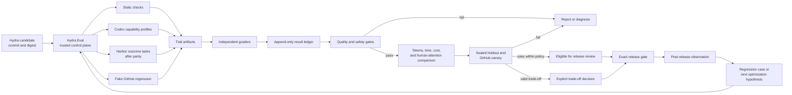

# Hydra evaluation and optimization system

## Design outcome

Hydra should be optimized for one outcome:

> Help an agent lead real software work to an accepted result, safely and with
> less unnecessary human attention, tokens, and elapsed time.

The agent is not evaluated as a text generator or a subordinate waiting for
approval at every step. It is evaluated as a collaborator that can understand
an outcome, act independently inside a delegated boundary, produce evidence,
recover from change, and stop at the exact decision that belongs to the human.

That makes quality and safety prerequisites. Token and time improvements matter
after those prerequisites are met. Hydra Eval will not hide this trade-off in a
single weighted score.

The durable core is the accepted outcome, delegated authority, attributable
evidence, and exact human decision boundary. Tools, adapters, suite layout,
schedules, and numeric thresholds are replaceable methods. The system may learn
and change those methods without quietly changing its purpose or safety boundary.

## Recommended system

Hydra Eval is an independent evaluation control plane. It evaluates an exact
Hydra candidate through several execution adapters, records attributable trial
evidence, compares the candidate with both the released version and a no-plugin
control, and determines whether the candidate is:

- rejected by evidence;
- missing evidence;
- eligible for the next automated stage; or
- waiting on one explicit human trade-off or release decision.

The evaluator may reject a regression and may continue a bounded experiment
without asking. It may not change its own acceptance rules, expose a private
holdout, grant itself authority, merge Hydra, or publish a release.

## What the system evaluates

The measured object is the complete configuration, not “the skill” or “the
model” in isolation:

`Hydra artifact + Codex version + model snapshot + reasoning setting + task +
grader + repository state + sandbox + tool permissions + network policy`

Every published result must name or fingerprint these inputs. A result that
cannot be attributed to an exact configuration is unmeasured, not a pass.

The suite covers seven increasingly realistic layers:

1. Package and static validation.
2. Plugin install, upgrade, uninstall, and rollback lifecycle.
3. Skill routing and description tests.
4. Behavior and judgment tests.
5. Repository outcome tasks in isolated environments.
6. Recovery and fault-injection tests.
7. Real GitHub lifecycle canaries.

Post-release observation then checks whether the evaluated behavior survives
fresh installation and real use.

Fast layers diagnose changes quickly. Later layers prove that those changes
survive real work. Passing an early layer never substitutes for a later layer.

## How optimization works

Each optimization starts from a measured failure or inefficiency and changes
one causal behavior at a time. The candidate first runs against a small
diagnostic subset, then the full paired public suite and a private validation
set. The exact candidate is then frozen before a one-time sealed holdout and
private canary.

The system defines three comparison arms on identical starting states:

- `no_plugin`: whether Hydra adds value at all;
- `stable`: whether the candidate improves on the released version;
- `candidate`: the exact proposed Hydra artifact.

Stable and candidate run together for release evidence. The no-plugin control
runs during calibration, major releases, and periodic checks of Hydra's
marginal value rather than adding cost to every small experiment.

A focused ablation may be added to explain which Hydra component caused the
change. Model or reasoning-setting changes are separate experiments so their
effect is not incorrectly credited to Hydra.

## Human involvement

The design deliberately avoids requiring a human at every stage. Automated
checks and agents should run routine, bounded evaluation, diagnosis, retry,
comparison, and evidence preparation. Public publication becomes automated only
inside a separately approved disclosure and retention policy.

Human attention is reserved for:

- changing the purpose or evaluation policy;
- accepting a real quality-versus-efficiency trade-off;
- granting new authority, credentials, or access to private data;
- approving a public release or material production effect;
- approving an exception after a control blocks the candidate.

The evidence record names the decision, not a ceremonial “responsible human”
field repeated on every run.

## Document routing

- [Evaluation system](evaluation-system.md): planes, adapters, suites, graders,
  evidence, provenance, and trust boundaries.
- [Experiments and release eligibility](experiments-and-promotion.md): controls,
  repetitions, metrics, statistical comparison, and release eligibility.
- [Optimization and automation](optimization-and-automation.md): improvement
  loop, GitHub/Codex schedules, budgets, canaries, failure, and rollback.
- [Decisions and open questions](decisions-and-open-questions.md): what this
  design recommends now, what pilots must determine, and what still requires a
  human decision.

## Status and non-goals

This is a design recommendation based on the committed research snapshot. It
does not implement an evaluator, select numeric release thresholds, create a
private repository, modify Hydra, alter a ruleset, install a schedule, or make
a release decision.

An implementation plan should be written only after this design is reviewed as
one whole system.
